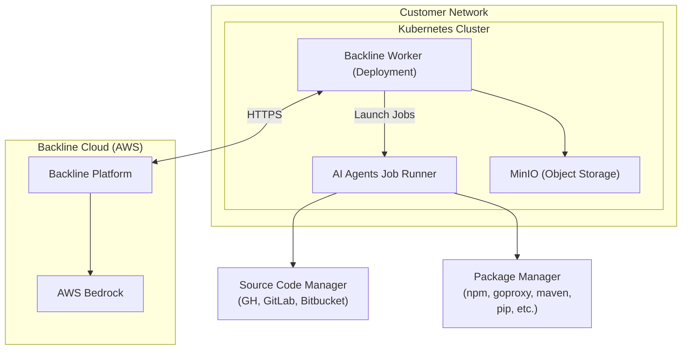

# Backline Helm Chart

## Overview
The Backline Helm chart deploys the on-premises Backline AI stack to your Kubernetes cluster.


**Chart Version:** 1.0.1
**App Version:** 1.0.1

## Table of Contents

- [Backline Helm Chart](#backline-helm-chart)
  - [Overview](#overview)
  - [Table of Contents](#table-of-contents)
  - [Prerequisites](#prerequisites)
  - [Architecture](#architecture)
  - [Installation](#installation)
    - [Quick Start](#quick-start)
    - [Installation with Custom Values File](#installation-with-custom-values-file)
  - [Configuration Parameters](#configuration-parameters)
    - [Global Configuration](#global-configuration)
    - [Janitor Configuration](#janitor-configuration)
    - [Worker Configuration](#worker-configuration)
      - [Worker OpenTelemetry Configuration](#worker-opentelemetry-configuration)
    - [MinIO Configuration](#minio-configuration)
    - [Resource Profiles](#resource-profiles)
  - [Secret Management](#secret-management)
    - [Static Secrets](#static-secrets)
    - [Dynamic Secrets](#dynamic-secrets)
    - [Troubleshooting Secret Issues](#troubleshooting-secret-issues)
  - [Configuration Examples](#configuration-examples)
    - [Minimal Installation](#minimal-installation)
    - [Advanced Configuration](#advanced-configuration)
  - [Upgrading](#upgrading)
  - [Uninstall](#uninstall)
  - [Troubleshooting](#troubleshooting)
    - [Worker Pod Not Starting](#worker-pod-not-starting)
    - [Janitor Job Failing](#janitor-job-failing)
    - [Image Pull Errors](#image-pull-errors)
  - [Support](#support)

## Prerequisites

- Kubernetes 1.19+
- Helm 3.x
- External network access to:
  - Backline AI SaaS endpoint
  - Source code management systems (GitHub, GitLab, Bitbucket)
  - Package managers (npm, Go modules, Maven, pip, etc.)

## Architecture

The chart deploys the following components:

- **Worker**: Main application handling code analysis workloads, AI interactions, and job orchestration
- **Janitor**: CronJob that performs automated maintenance tasks including JWT token refresh, Docker registry authentication updates, and worker image updates
- **ADOT Collector**: Sidecar container for exporting logs, traces, and metrics to Backline AI cloud infrastructure
- **MinIO**: Object storage for static assets and operational data (deployed as a subchart)
- **Coder Jobs**: Dynamically created Kubernetes Jobs for code execution (template embedded in worker ConfigMap)
- **Dependabot Upgrader Jobs**: Dynamically created Kubernetes Jobs for dependency updates (template embedded in worker ConfigMap)

## Installation

### Quick Start

Install the chart with required values:

```bash
# install Backline helm repository
helm repo add backline-ai https://backline-labs.github.io/charts
helm repo update backline-ai
# install the chart
helm install backline \
  backline-ai/backline \
  --namespace backline \
  --version 1.0.1 \
  --create-namespace \
  --set accessKey='<YOUR ACCESS KEY>'
```

### Installation with Custom Values File

Create a `custom-values.yaml` file with your configuration:

```yaml
accessKey: "your-secret-access-key"
environment: "production"
```

Install using the custom values:

```bash
helm install backline backline-ai/backline \
  --values custom-values.yaml \
  --namespace backline
```

## Configuration Parameters

### Global Configuration

| Parameter           | Description                                                       | Required | Default    |
| ------------------- | ----------------------------------------------------------------- | -------- | ---------- |
| `accessKey`         | Authentication key for API access                                 | Yes      | `""`       |
| `namespaceOverride` | Override the default namespace                                    | No       | `backline` |
| `environment`       | Backline AI SaaS endpoint environment (`staging` or `production`) | Yes      | `staging`  |

### Janitor Configuration

The Janitor component runs periodic maintenance tasks as a CronJob.

| Parameter                           | Description        | Default              |
| ----------------------------------- | ------------------ | -------------------- |
| `janitor.image.registry`            | Container registry | `docker.io`          |
| `janitor.image.name`                | Image name         | `dtzar/helm-kubectl` |
| `janitor.image.tag`                 | Image tag          | `3.16.1`             |
| `janitor.image.pullPolicy`          | Image pull policy  | `IfNotPresent`       |
| `janitor.resources.requests.cpu`    | CPU request        | `100m`               |
| `janitor.resources.requests.memory` | Memory request     | `128Mi`              |
| `janitor.resources.limits.cpu`      | CPU limit          | `200m`               |
| `janitor.resources.limits.memory`   | Memory limit       | `256Mi`              |

### Worker Configuration

The Worker is the main application component.

| Parameter                          | Description                                        | Default                                                |
| ---------------------------------- | -------------------------------------------------- | ------------------------------------------------------ |
| `worker.replicaCount`              | Number of worker replicas                          | `1`                                                    |
| `worker.image.name`                | Image name                                         | `prod-runner`                                          |
| `worker.image.tag`                 | Image tag                                          | `0000001-0000000001`                                   |
| `worker.image.pullPolicy`          | Image pull policy                                  | `IfNotPresent`                                         |
| `worker.service.httpPort`          | HTTP service port                                  | `8080`                                                 |
| `worker.modelName`                 | AI model for code generation tasks                 | `bedrock/us.anthropic.claude-sonnet-4-5-20250929-v1:0` |
| `worker.structuredOutputModelName` | AI model for structured output parsing             | `claude-haiku-4-5-20251001`                            |
| `worker.resources.requests.cpu`    | CPU request                                        | `500m`                                                 |
| `worker.resources.requests.memory` | Memory request                                     | `1Gi`                                                  |
| `worker.resources.limits.cpu`      | CPU limit                                          | `2000m`                                                |
| `worker.resources.limits.memory`   | Memory limit                                       | `2Gi`                                                  |
| `worker.livenessProbe`             | Liveness probe configuration                       | See values.yaml                                        |
| `worker.readinessProbe`            | Readiness probe configuration                      | See values.yaml                                        |
| `worker.env`                       | Additional environment variables                   | `[]`                                                   |
| `worker.envFromSecrets`            | List of secrets to inject as environment variables | `[]`                                                   |
| `worker.nodeSelector`              | Node selector for pod assignment                   | `{}`                                                   |
| `worker.tolerations`               | Tolerations for pod assignment                     | `[]`                                                   |
| `worker.affinity`                  | Affinity rules for pod assignment                  | `{}`                                                   |

#### Worker OpenTelemetry Configuration

| Parameter                     | Description                      | Default                                                       |
| ----------------------------- | -------------------------------- | ------------------------------------------------------------- |
| `worker.otel.enabled`         | Enable OpenTelemetry             | `true`                                                        |
| `worker.otel.collector.image` | Image used to run OTEL collector | `public.ecr.aws/aws-observability/aws-otel-collector:v0.45.1` |

### MinIO Configuration

MinIO provides object storage for static assets and operational data.

| Parameter                    | Description                            | Default                    |
| ---------------------------- | -------------------------------------- | -------------------------- |
| `minio.enabled`              | Enable MinIO subchart                  | `true`                     |
| `minio.mode`                 | MinIO deployment mode                  | `standalone`               |
| `minio.rootUser`             | MinIO root username                    | `backline`                 |
| `minio.rootPassword`         | MinIO root password                    | `backline-minio-password`  |
| `minio.persistence.enabled`  | Enable persistent storage for MinIO   | `true`                     |
| `minio.persistence.size`     | MinIO storage size                     | `10Gi`                     |
| `minio.persistence.storageClass` | Storage class for MinIO PVC       | `""`                       |
| `minio.resources.requests.cpu` | CPU request                          | `100m`                     |
| `minio.resources.requests.memory` | Memory request                    | `256Mi`                    |
| `minio.resources.limits.cpu` | CPU limit                              | `500m`                     |
| `minio.resources.limits.memory` | Memory limit                        | `512Mi`                    |
| `minio.buckets`              | List of buckets to create              | `static-assets`, `operational` |

### Resource Profiles

Resource profiles define CPU and memory allocations for ephemeral jobs (Coder and Dependabot Upgrader).

| Profile   | CPU Request | CPU Limit | Memory Request | Memory Limit |
| --------- | ----------- | --------- | -------------- | ------------ |
| `small`   | 500m        | 1000m     | 1Gi            | 2Gi          |
| `medium`  | 2000m       | 2000m     | 8Gi            | 8Gi          |
| `large`   | 4000m       | 4000m     | 16Gi           | 16Gi         |
| `xlarge`  | 8000m       | 8000m     | 32Gi           | 32Gi         |

You can customize these profiles in your values file:

```yaml
resourceProfiles:
  small:
    requests:
      cpu: "500m"
      memory: "1Gi"
    limits:
      cpu: "1000m"
      memory: "2Gi"
```

## Secret Management

The chart manages secrets automatically through the Janitor CronJob. Understanding this system is critical for troubleshooting authentication issues.

### Static Secrets

**`accesskey`** - Created during chart installation
- Type: `Opaque`
- Contains: `ACCESS_KEY` for API authentication
- Source: Provided via `accessKey` in values.yaml
- Lifecycle: Created once, not automatically updated

### Dynamic Secrets

The Janitor CronJob automatically creates and rotates the following secrets:

**`session-jwt`** - JWT token for AWS authentication
- Type: `Opaque`
- Contains: `token` field with JWT from Backline API
- Refresh frequency: Every 3 minutes
- Usage: Used by ADOT collector for AWS service authentication (CloudWatch, X-Ray, AMP)
- Annotation: `backline.ai/updatedAt` tracks last update timestamp (epoch seconds)

**`dockerconfig`** - Docker registry credentials
- Type: `kubernetes.io/dockerconfigjson`
- Contains: ECR authentication credentials
- Refresh frequency: Every 8 hours
- Usage: Allows worker deployment to pull images from private ECR registry

### Troubleshooting Secret Issues

**ImagePullBackOff on worker pods:**
- Wait for janitor to create/refresh the `dockerconfig` secret.
- Manually trigger: `kubectl create job -n backline --from=cronjob/janitor janitor-manual`
- Check janitor logs: `kubectl logs -n backline job/janitor-<timestamp>`

**AWS authentication failures in ADOT collector:**
- Verify `session-jwt` secret exists: `kubectl get secret -n backline session-jwt`
- Check JWT expiration and refresh: `kubectl describe secret -n backline session-jwt`
- Ensure `accessKey` is valid for the resolved base URL (derived from `environment`)

**Manual secret inspection:**
```bash
# Check all secrets
kubectl get secrets -n backline

# View secret annotations and age
kubectl describe secret -n backline session-jwt
kubectl describe secret -n backline dockerconfig

# Force janitor to run immediately
kubectl create job -n backline --from=cronjob/janitor janitor-manual
```

## Configuration Examples

### Minimal Installation

Minimal `values.yaml`:

```yaml
accessKey: "your-secret-key"
environment: "staging"
```

### Advanced Configuration

Advanced configuration with increased resources:

```yaml
accessKey: "your-secret-key"
namespaceOverride: "backline-prod"

janitor:
  resources:
    requests:
      cpu: "200m"
      memory: "256Mi"
    limits:
      cpu: "500m"
      memory: "512Mi"

worker:
  replicaCount: 2
  resources:
    requests:
      cpu: "1000m"
      memory: "2Gi"
    limits:
      cpu: "4000m"
      memory: "4Gi"
  env:
    - name: MODEL_NAME
      value: "anthropic/claude-sonnet-4-20250514"

minio:
  persistence:
    size: "50Gi"

resourceProfiles:
  medium:
    requests:
      cpu: "4000m"
      memory: "16Gi"
    limits:
      cpu: "4000m"
      memory: "16Gi"

environment: "production"
```


## Upgrading

Upgrade an existing release with new values:

```bash
helm upgrade backline \
  backline-ai/backline \
  --namespace backline \
  --reuse-values
```

Or with a values file:

```bash
helm upgrade backline \
  backline-ai/backline \
  --namespace backline \
  --values updated-values.yaml
```

## Uninstall

Remove the Helm release:

```bash
helm uninstall backline --namespace backline
```

**Note:** The PersistentVolumeClaim may not be automatically deleted if not created by the chart

## Troubleshooting

### Worker Pod Not Starting

**Symptom:** Worker pod in `CrashLoopBackOff` or failing health checks.

**Solution:**
- Verify `accessKey` and `environment` are correct.
- Check worker logs for authentication errors:

```bash
kubectl logs -n backline deployment/worker -c worker
```

### Janitor Job Failing

**Symptom:** Janitor CronJob fails repeatedly.

**Solution:**
- Check janitor logs:

```bash
kubectl logs -n backline job/janitor-<timestamp> -c janitor
```

- Common issues:
  - Invalid `accessKey`: Verify the key is correct
  - Network connectivity: Ensure the janitor can reach the resolved base URL

### Image Pull Errors

**Symptom:** `ImagePullBackOff` errors on worker pods.

**Solution:**
- The janitor automatically creates and refreshes the `dockerconfig` secret
- Wait for the janitor to run (default: every minute)
- Manually trigger if needed:

```bash
kubectl create job -n backline --from=cronjob/janitor janitor-manual
```
## Support

For issues, questions, or feature requests, please contact [Backline support](mailto:support@backline.ai).
