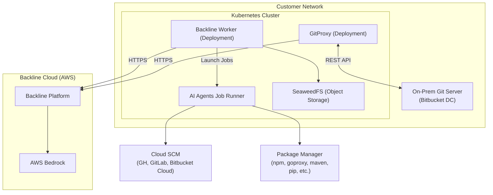

# Backline Helm Chart

## Overview
The Backline Helm chart deploys the on-premises Backline AI stack to your Kubernetes cluster.

```mermaid
graph TB
  subgraph BC["Backline Cloud (AWS)"]
      BP["Backline Platform"]
      AWB["AWS Bedrock"]
      BP --> AWB
  end
  subgraph CN["Customer Network"]
      subgraph KC["Kubernetes Cluster"]
          BW["Backline Worker (Deployment)"]
          GP["GitProxy (Deployment)"]
          AJJR["AI Agents Job Runner"]
          SWFS["SeaweedFS (Object Storage)"]
          BW -->|Launch Jobs| AJJR
          BW --> SWFS
      end
      ONPREM_SCM["On-Prem Git Server<br/>(Bitbucket DC)"]
  end

  SCM["Cloud SCM<br/>(GH, GitLab, Bitbucket Cloud)"]
  PM["Package Manager<br/>(npm, goproxy, maven,<br/>pip, etc.)"]

  BW -->|HTTPS| BP
  GP -->|HTTPS| BP
  GP <-->|REST API| ONPREM_SCM
  AJJR --> SCM
  AJJR --> PM
```

**Chart Version:** 1.5.0
**App Version:** 1.1.0

## Table of Contents

- [Backline Helm Chart](#backline-helm-chart)
  - [Overview](#overview)
  - [Table of Contents](#table-of-contents)
  - [Prerequisites](#prerequisites)
  - [Architecture](#architecture)
  - [Installation](#installation)
    - [Quick Start](#quick-start)
    - [Installation with Custom Values File](#installation-with-custom-values-file)
  - [Configuration Parameters](#configuration-parameters)
    - [Global Configuration](#global-configuration)
    - [Proxy Configuration](#proxy-configuration)
    - [External Secrets Configuration](#external-secrets-configuration)
    - [Janitor Configuration](#janitor-configuration)
    - [Worker Configuration](#worker-configuration)
      - [Worker OpenTelemetry Configuration](#worker-opentelemetry-configuration)
    - [GitProxy Configuration](#gitproxy-configuration)
    - [SeaweedFS Configuration](#seaweedfs-configuration)
      - [Object Retention](#object-retention)
    - [Resource Profiles](#resource-profiles)
  - [High Availability Recommendations](#high-availability-recommendations)
    - [Component Availability Model](#component-availability-model)
    - [Cluster Prerequisites](#cluster-prerequisites)
    - [Worker and GitProxy](#worker-and-gitproxy)
    - [Pod Disruption Budgets](#pod-disruption-budgets)
    - [Janitor](#janitor)
    - [Complete HA Values Example](#complete-ha-values-example)
  - [Network Policy Recommendations (Egress Whitelist)](#network-policy-recommendations-egress-whitelist)
    - [DNS Resolution](#dns-resolution)
    - [Package Registries](#package-registries)
      - [JavaScript/Node.js (npm, yarn)](#javascriptnodejs-npm-yarn)
      - [Python (PyPI, Conda)](#python-pypi-conda)
      - [Java (Maven, Gradle)](#java-maven-gradle)
      - [Go Modules](#go-modules)
      - [Rust (Cargo/crates.io)](#rust-cargocratesio)
    - [Container Registries](#container-registries)
    - [Source Code Managers](#source-code-managers)
    - [LLM API Access](#llm-api-access)
    - [AWS Services](#aws-services)
      - [AWS ECR (Elastic Container Registry)](#aws-ecr-elastic-container-registry)
    - [Custom/Private Registries](#customprivate-registries)
      - [JFrog Artifactory](#jfrog-artifactory)
      - [Other Private Registries](#other-private-registries)
    - [Quick Reference: Minimal Egress Whitelist](#quick-reference-minimal-egress-whitelist)
    - [Troubleshooting Network Policy Issues](#troubleshooting-network-policy-issues)
  - [Secret Management](#secret-management)
    - [Static Secrets](#static-secrets)
    - [External Secrets](#external-secrets)
    - [Dynamic Secrets](#dynamic-secrets)
    - [Troubleshooting Secret Issues](#troubleshooting-secret-issues)
  - [Configuration Examples](#configuration-examples)
    - [Minimal Installation](#minimal-installation)
    - [Advanced Configuration](#advanced-configuration)
  - [Upgrading](#upgrading)
  - [Uninstall](#uninstall)
  - [Troubleshooting](#troubleshooting)
    - [Worker Pod Not Starting](#worker-pod-not-starting)
    - [Janitor Job Failing](#janitor-job-failing)
    - [Image Pull Errors](#image-pull-errors)
  - [Support](#support)

## Prerequisites

- Kubernetes 1.19+
- Helm 3.x
- External network access to:
  - Backline AI SaaS endpoint
  - Source code management systems (GitHub, GitLab, Bitbucket)
  - Package managers (npm, Go modules, Maven, pip, etc.)
  - See more in the Network Policy Recommendations section below
- Optional: [External Secrets Operator](https://external-secrets.io) with a `SecretStore` or `ClusterSecretStore`, if you want the chart's secrets sourced from a secret manager (see [External Secrets](#external-secrets))

## Architecture

The chart deploys the following components:

- **Worker**: Main application handling code analysis workloads, AI interactions, and job orchestration
- **GitProxy** *(optional)*: Enables Backline to work with on-prem git servers (e.g., Bitbucket Data Center) by proxying git API operations. Runs on the customer network and makes outbound-only connections to Backline cloud. Disabled by default
- **Janitor**: CronJob that performs automated maintenance tasks including JWT token refresh, Docker registry authentication updates, and worker/gitproxy image updates
- **ADOT Collector**: Sidecar container for exporting logs, traces, and metrics to Backline AI cloud infrastructure
- **SeaweedFS**: Object storage for static assets and operational data (deployed as a subchart)
- **Coder Jobs**: Dynamically created Kubernetes Jobs for code execution (template embedded in worker ConfigMap)
- **Dependabot Upgrader Jobs**: Dynamically created Kubernetes Jobs for dependency updates (template embedded in worker ConfigMap)

## Installation

### Quick Start

Install the chart with required values:

```bash
# install Backline helm repository
helm repo add backline-ai https://backline-labs.github.io/charts
helm repo update backline-ai
# install the chart
helm install backline \
  backline-ai/backline \
  --namespace backline \
  --create-namespace \
  --set accessKey='<YOUR ACCESS KEY>'
```

### Installation with Custom Values File

Create a `custom-values.yaml` file with your configuration:

```yaml
accessKey: "your-secret-access-key"
environment: "production"
```

Install using the custom values:

```bash
helm install backline backline-ai/backline \
  --values custom-values.yaml \
  --namespace backline
```

## Configuration Parameters

### Global Configuration

| Parameter           | Description                                                                                                                                                                     | Required | Default      |
| ------------------- | ------------------------------------------------------------------------------------------------------------------------------------------------------------------------------- | -------- | ------------ |
| `accessKey`         | Authentication key for API access. Not needed when sourced from a secret manager via `externalSecrets.accessKey`                                                                | Yes      | `""`         |
| `namespaceOverride` | Override the default namespace                                                                                                                                                  | No       | `backline`   |
| `environment`       | Backline AI SaaS endpoint environment (`staging` or `production`)                                                                                                               | Yes      | `production` |
| `customCaCert`      | Base64-encoded PEM CA certificate(s) used for trusted communication with a self-hosted git host (internal/corporate CA). See "Trusting a self-hosted git server's internal CA". | No       | `""`         |

### Proxy Configuration

For clusters that route outbound traffic through a corporate proxy. When set, these are injected (both upper- and lower-case) into the worker, gitproxy and janitor containers. Leave empty to connect directly.

| Parameter          | Description                                                                                                | Default |
| ------------------ | ---------------------------------------------------------------------------------------------------------- | ------- |
| `proxy.httpProxy`  | Outbound HTTP proxy URL                                                                                    | `""`    |
| `proxy.httpsProxy` | Outbound HTTPS proxy URL                                                                                   | `""`    |
| `proxy.noProxy`    | Comma-separated hosts/CIDRs to reach directly — include your internal git server and in-cluster addresses | `""`    |

### External Secrets Configuration

Source the chart's static secrets from a secret manager through the External Secrets Operator instead of placing values in `values.yaml`. Enabling a secret renders an `ExternalSecret` in place of the `Secret`; see [External Secrets](#external-secrets) for the model, examples and troubleshooting.

| Parameter                                           | Description                                                                                                                   | Default                   |
| --------------------------------------------------- | ----------------------------------------------------------------------------------------------------------------------------- | ------------------------- |
| `externalSecrets.apiVersion`                        | API version served by your operator. Operators older than 0.17 need `external-secrets.io/v1beta1`                              | `external-secrets.io/v1`  |
| `externalSecrets.secretStoreRef.name`               | Default `SecretStore` / `ClusterSecretStore` every ExternalSecret reads from. Required once any secret below is enabled        | `""`                      |
| `externalSecrets.secretStoreRef.kind`               | `SecretStore` (namespaced) or `ClusterSecretStore`                                                                            | `SecretStore`             |
| `externalSecrets.refreshInterval`                   | Default interval at which the operator re-reads the provider                                                                  | `1h`                      |
| `externalSecrets.accessKey.enabled`                 | Sync the `accesskey` Secret from the provider. `accessKey` is then ignored                                                     | `false`                   |
| `externalSecrets.accessKey.remoteRef`               | ESO `remoteRef` for the `ACCESS_KEY` value. `key` is required; other ESO fields pass through                                   | `{key: ""}`               |
| `externalSecrets.customCaCert.enabled`              | Sync the `custom-ca` Secret from the provider. `customCaCert` is then ignored                                                  | `false`                   |
| `externalSecrets.customCaCert.remoteRef`            | ESO `remoteRef` for the PEM CA bundle. Add `decodingStrategy: Base64` if the provider stores it base64-encoded                 | `{key: ""}`               |
| `externalSecrets.objectStorage.enabled`             | Sync the `seaweedfs-s3-secret` Secret from the provider. `objectStorage.accessKey` / `objectStorage.secretKey` are then ignored | `false`                   |
| `externalSecrets.objectStorage.accessKey.remoteRef` | ESO `remoteRef` for the S3 access key                                                                                         | `{key: ""}`               |
| `externalSecrets.objectStorage.secretKey.remoteRef` | ESO `remoteRef` for the S3 secret key                                                                                         | `{key: ""}`               |
| `externalSecrets.<secret>.secretStoreRef`           | Per-secret override of the default store (`name` and/or `kind`)                                                               | unset                     |
| `externalSecrets.<secret>.refreshInterval`          | Per-secret override of the default refresh interval                                                                           | unset                     |

### Janitor Configuration

The Janitor component runs periodic maintenance tasks as a CronJob. It also keeps the Worker and GitProxy images on the newest published build, and `helm upgrade` preserves the tag it set, so leave `worker.image.tag` and `gitproxy.image.tag` empty unless you deliberately want to override it.

| Parameter                           | Description        | Default              |
| ----------------------------------- | ------------------ | -------------------- |
| `janitor.image.registry`            | Container registry | `docker.io`          |
| `janitor.image.name`                | Image name         | `dtzar/helm-kubectl` |
| `janitor.image.tag`                 | Image tag          | `3.16.1`             |
| `janitor.image.pullPolicy`          | Image pull policy  | `IfNotPresent`       |
| `janitor.resources.requests.cpu`    | CPU request        | `100m`               |
| `janitor.resources.requests.memory` | Memory request     | `128Mi`              |
| `janitor.resources.limits.cpu`      | CPU limit          | `200m`               |
| `janitor.resources.limits.memory`   | Memory limit       | `256Mi`              |

### Worker Configuration

The Worker is the main application component.

| Parameter                          | Description                                        | Default                                                |
| ---------------------------------- | -------------------------------------------------- | ------------------------------------------------------ |
| `worker.replicaCount`              | Number of worker replicas                          | `1`                                                    |
| `worker.image.name`                | Image name                                         | `prod-runner`                                          |
| `worker.image.tag`                 | Image tag. Leave empty: the Janitor tracks the newest published build and `helm upgrade` keeps the tag it set | `""`                                                   |
| `worker.image.pullPolicy`          | Image pull policy                                  | `IfNotPresent`                                         |
| `worker.service.httpPort`          | HTTP service port                                  | `8080`                                                 |
| `worker.resources.requests.cpu`    | CPU request                                        | `500m`                                                 |
| `worker.resources.requests.memory` | Memory request                                     | `1Gi`                                                  |
| `worker.resources.limits.cpu`      | CPU limit                                          | `2000m`                                                |
| `worker.resources.limits.memory`   | Memory limit                                       | `2Gi`                                                  |
| `worker.livenessProbe`             | Liveness probe configuration                       | See values.yaml                                        |
| `worker.readinessProbe`            | Readiness probe configuration                      | See values.yaml                                        |
| `worker.env`                       | Additional environment variables                   | `[]`                                                   |
| `worker.envFromSecrets`            | List of secrets to inject as environment variables | `[]`                                                   |
| `worker.nodeSelector`              | Node selector for pod assignment                   | `{}`                                                   |
| `worker.tolerations`               | Tolerations for pod assignment                     | `[]`                                                   |
| `worker.affinity`                  | Affinity rules for pod assignment                  | `{}`                                                   |

#### Worker OpenTelemetry Configuration

| Parameter                     | Description                      | Default                                                       |
| ----------------------------- | -------------------------------- | ------------------------------------------------------------- |
| `worker.otel.enabled`         | Enable OpenTelemetry             | `true`                                                        |
| `worker.otel.collector.image` | Image used to run OTEL collector | `public.ecr.aws/aws-observability/aws-otel-collector:v0.45.1` |

### GitProxy Configuration

GitProxy enables Backline to interact with on-prem git servers that are not accessible from the internet. It runs on the customer's network and communicates with Backline cloud via outbound HTTPS connections. No additional credentials are needed — GitProxy uses the same `accessKey` as the Worker.

| Parameter | Description | Default |
| --- | --- | --- |
| `gitproxy.enabled` | Enable GitProxy component | `false` |
| `gitproxy.replicaCount` | Number of GitProxy replicas | `1` |
| `gitproxy.image.name` | Image name | `prod-gitproxy` |
| `gitproxy.image.tag` | Image tag. Leave empty: the Janitor tracks the newest published build and `helm upgrade` keeps the tag it set | `""` |
| `gitproxy.image.pullPolicy` | Image pull policy | `IfNotPresent` |
| `gitproxy.adapter.skipCertVerification` | Skip TLS verification for adapter connection | `false` |
| `gitproxy.adapter.maxRetries` | Max retries for adapter HTTP calls | `3` |
| `gitproxy.adapter.retryDelay` | Delay between retries | `1s` |
| `gitproxy.temporal.maxConcurrentActivities` | Max concurrent git operations | `20` |
| `gitproxy.resources.requests.cpu` | CPU request | `250m` |
| `gitproxy.resources.requests.memory` | Memory request | `256Mi` |
| `gitproxy.resources.limits.cpu` | CPU limit | `500m` |
| `gitproxy.resources.limits.memory` | Memory limit | `512Mi` |
| `gitproxy.otel.enabled` | Enable OpenTelemetry | `true` |
| `gitproxy.otel.collector.image` | OTEL collector image | `public.ecr.aws/aws-observability/aws-otel-collector:v0.45.1` |
| `gitproxy.nodeSelector` | Node selector for pod assignment | `{}` |
| `gitproxy.tolerations` | Tolerations for pod assignment | `[]` |
| `gitproxy.affinity` | Affinity rules for pod assignment | `{}` |

**Enabling GitProxy:**

```bash
helm upgrade backline backline-ai/backline \
  --namespace backline \
  --reuse-values \
  --set gitproxy.enabled=true
```

**Trusting a self-hosted git server's internal CA:**

If your git server's TLS certificate is signed by an internal/corporate CA, supply that CA so Backline trusts it (otherwise connections fail with `x509: certificate signed by unknown authority`). `customCaCert` takes the **base64-encoded PEM** of the CA certificate (or chain) as a single line — generate it from your CA file:

```bash
base64 -w0 ca.pem            # Linux (GNU base64)
# or, portable / macOS:
base64 < ca.pem | tr -d '\n'
```

Then set the value:

```yaml
customCaCert: "LS0tLS1CRUdJTiBDRVJUSUZJQ0FURS0t...=="   # base64 of your CA's PEM (or chain)
```

### SeaweedFS Configuration

| Parameter                                     | Description                                                                 | Default                         |
| --------------------------------------------- | --------------------------------------------------------------------------- | ------------------------------- |
| `objectStorage.accessKey`                     | S3 access key (worker + SeaweedFS gateway)                                  | `backline`                      |
| `objectStorage.secretKey`                     | S3 secret key (worker + SeaweedFS gateway)                                  | `backline-seaweedfs-password`   |
| `seaweedfs.enabled`                           | Enable the bundled store (`false` → use external S3)                        | `true`                          |
| `seaweedfs.fullnameOverride`                  | Name prefix for SeaweedFS resources (used to build its service DNS)         | `seaweedfs`                     |
| `seaweedfs.master.enabled`                    | Run a standalone master (the all-in-one pod provides one)                   | `false`                         |
| `seaweedfs.volume.enabled`                    | Run standalone volume servers (the all-in-one pod provides one)             | `false`                         |
| `seaweedfs.volume.dataDirs[0].maxVolumes`     | Volume-count cap, passed to the pod as `-volume.max`                        | `100`                           |
| `seaweedfs.volume.dataDirs[0].name`           | Unused in all-in-one mode (data comes from `allInOne.data`)                 | `data1`                         |
| `seaweedfs.volume.dataDirs[0].type`           | Unused in all-in-one mode (data comes from `allInOne.data`)                 | `hostPath`                      |
| `seaweedfs.volume.dataDirs[0].hostPathPrefix` | Unused in all-in-one mode (data comes from `allInOne.data`)                 | `/ssd`                          |
| `seaweedfs.filer.enabled`                     | Run a standalone filer (the all-in-one pod provides one)                    | `false`                         |
| `seaweedfs.filer.port`                        | Filer HTTP port (endpoint for the retention hook)                           | `8888`                          |
| `seaweedfs.s3.enabled`                        | Run a standalone S3 gateway (the all-in-one pod provides one)               | `false`                         |
| `seaweedfs.s3.port`                           | S3 API port (exposed on the `seaweedfs-all-in-one` svc)                     | `8333`                          |
| `seaweedfs.allInOne.enabled`                  | Run the single-node all-in-one pod                                          | `true`                          |
| `seaweedfs.allInOne.data.type`                | Volume source for `/data` (`persistentVolumeClaim`, `hostPath`, `emptyDir`) | `persistentVolumeClaim`         |
| `seaweedfs.allInOne.data.size`                | Persistent volume size                                                      | `10Gi`                          |
| `seaweedfs.allInOne.data.storageClass`        | Storage class for the PVC (`""` = cluster default)                          | `""`                            |
| `seaweedfs.allInOne.s3.enabled`               | Expose the S3 gateway on the all-in-one pod                                 | `true`                          |
| `seaweedfs.allInOne.s3.enableAuth`            | Require the `objectStorage` credentials on S3 requests                      | `true`                          |
| `seaweedfs.allInOne.s3.existingConfigSecret`  | Secret holding the S3 identities (`seaweedfs_s3_config`)                    | `seaweedfs-s3-secret`           |
| `seaweedfs.allInOne.s3.createBuckets`         | Buckets created by the post-install hook                                    | `operational`, `static-assets`  |
| `seaweedfs.allInOne.s3.createBuckets[].ttl`   | Retention window for the bucket (e.g. `7d`)                                 | `7d` on `operational`           |
| `seaweedfs.allInOne.resources`                | All-in-one pod resource requests/limits                                     | `100m`/`256Mi` … `500m`/`512Mi` |

#### Object Retention

Objects written to the `operational` bucket are deleted 7 days later. `static-assets` has
no expiry.

To change the window, set `ttl` on the bucket — a count of 1-255 followed by `m`, `h`,
`d`, `w`, `M` (month) or `y`, so a year is written `1y` and not `365d`:

```yaml
seaweedfs:
  allInOne:
    s3:
      createBuckets:
        - name: operational
          ttl: 30d
        - name: static-assets
```

The new window applies to objects written after the next `helm upgrade`; objects already
stored keep the expiry they were given when they were written.

`operational` and `static-assets` both hold regenerable data, so either can be emptied
by hand — substitute the bucket name:

```bash
# 1. drop the bucket and everything in it
kubectl exec -n backline deploy/seaweedfs-all-in-one -- \
  sh -c "echo 's3.bucket.delete -name operational' | weed shell"

# 2. re-create it, empty
kubectl exec -n backline deploy/seaweedfs-all-in-one -- \
  sh -c "echo 's3.bucket.create -name operational' | weed shell"
```

The `ttl` still applies to the re-created bucket.

### Resource Profiles

Resource profiles define CPU and memory allocations for ephemeral jobs (Coder and Dependabot Upgrader).

| Profile   | CPU Request | CPU Limit | Memory Request | Memory Limit |
| --------- | ----------- | --------- | -------------- | ------------ |
| `small`   | 250m        | 1000m     | 1Gi            | 2Gi          |
| `medium`  | 500m        | 2000m     | 4Gi            | 8Gi          |
| `large`   | 1000m       | 4000m     | 8Gi            | 16Gi         |
| `xlarge`  | 2000m       | 8000m     | 16Gi           | 32Gi         |

You can customize these profiles in your values file:

```yaml
resourceProfiles:
  small:
    requests:
      cpu: "250m"
      memory: "1Gi"
    limits:
      cpu: "1000m"
      memory: "2Gi"
```

## High Availability Recommendations

The chart defaults are sized for a single-node evaluation install: one Worker replica and one GitProxy replica. The settings below make the deployment survive a node failure, a node drain, and a rolling cluster upgrade.

> **Note:** Backline does not enforce these settings. They are recommendations — apply the ones your cluster topology and availability targets call for.

### Component Availability Model

| Component | Workload | Scales out | Impact while unavailable |
| --------- | -------- | ---------- | ------------------------ |
| **Worker** | Deployment | Yes — `worker.replicaCount` | No new analysis or remediation work is picked up. Pods for already-dispatched Coder Jobs keep running |
| **GitProxy** | Deployment | Yes — `gitproxy.replicaCount` | Git API operations against the on-prem git server stall |
| **Janitor** | CronJob, `concurrencyPolicy: Forbid` | No — singleton by design | Secret rotation pauses: `session-jwt` (3 min) and `dockerconfig` (8 h) go stale, which eventually breaks telemetry export, ECR image pulls, and Coder Job authentication |
| **SeaweedFS** | all-in-one pod | No | Object storage reads/writes fail. The `operational` and `static-assets` buckets hold regenerable cache, so this is a performance loss, not data loss |
| **Coder / Upgrader Jobs** | one Job per task | N/A | Individual task fails; Kubernetes does not retry it (`backoffLimit: 0`, `restartPolicy: Never`) |

### Cluster Prerequisites

- **At least 2 schedulable nodes**, so Worker and GitProxy replicas can sit on different ones.
- **Zone awareness (optional).** To spread replicas across failure domains rather than nodes, set `topologyKey: topology.kubernetes.io/zone` in the affinity rules below, or use `topologySpreadConstraints`.

### Worker and GitProxy

Run at least two replicas of each. Neither component keeps state in the cluster — both make outbound connections to Backline cloud and pull their own work — so replicas need no coordination, leader election, or shared volume.

```yaml
worker:
  replicaCount: 2
  affinity:
    podAntiAffinity:
      requiredDuringSchedulingIgnoredDuringExecution:
        - labelSelector:
            matchLabels:
              app: worker
          topologyKey: kubernetes.io/hostname

gitproxy:
  enabled: true
  replicaCount: 2
  affinity:
    podAntiAffinity:
      requiredDuringSchedulingIgnoredDuringExecution:
        - labelSelector:
            matchLabels:
              app: gitproxy
          topologyKey: kubernetes.io/hostname
```

Use `requiredDuringSchedulingIgnoredDuringExecution` only when you have at least as many nodes as replicas; otherwise switch to `preferredDuringSchedulingIgnoredDuringExecution` so replicas still schedule on a smaller cluster. To spread across failure domains instead of nodes, set `topologyKey: topology.kubernetes.io/zone`.

Notes on rollouts:

- Both Deployments use the default `RollingUpdate` strategy (25% each way), which at two replicas rounds `maxUnavailable` down to 0 and `maxSurge` up to 1 — the replacement pod becomes ready before the old one is retired. Janitor-driven image updates and `rollout restart` therefore do not create a gap on their own. From four replicas up, `maxUnavailable` becomes 1; pin it to 0 explicitly if you need the same guarantee at that size.
- What a second replica buys you is coverage for the disruptions a rollout cannot schedule around: node failure, node drain, eviction under memory pressure, and liveness-probe restarts.

### Pod Disruption Budgets

The chart does not template PodDisruptionBudgets. Apply your own so a node drain cannot evict every replica at once — the chart labels Worker pods `app: worker` and GitProxy pods `app: gitproxy`:

```yaml
apiVersion: policy/v1
kind: PodDisruptionBudget
metadata:
  name: worker
  namespace: backline
spec:
  minAvailable: 1
  selector:
    matchLabels:
      app: worker
---
apiVersion: policy/v1
kind: PodDisruptionBudget
metadata:
  name: gitproxy
  namespace: backline
spec:
  minAvailable: 1
  selector:
    matchLabels:
      app: gitproxy
```

> **Warning:** Add a PDB only after raising `replicaCount` to 2 or more. `minAvailable: 1` against a single replica makes `kubectl drain` hang indefinitely.

### Janitor

The Janitor is deliberately a singleton — `concurrencyPolicy: Forbid` prevents two runs from writing the same secrets. It needs no HA configuration: the CronJob schedules a fresh Job every minute, and a lost node simply moves the next run elsewhere.

What it does need is monitoring. A Janitor that fails repeatedly is silent until the secrets it maintains expire, and then image pulls and Coder Job authentication start failing. Alert on the last successful run, or on the freshness annotation the Janitor stamps on each secret:

```bash
kubectl get cronjob janitor -n backline -o jsonpath='{.status.lastSuccessfulTime}'
kubectl get secret session-jwt -n backline -o jsonpath='{.metadata.annotations.backline\.ai/updatedAt}'
```

### Complete HA Values Example

Two Workers and two GitProxies, each pair spread across nodes:

```yaml
accessKey: "your-secret-access-key"
environment: "production"

worker:
  replicaCount: 2
  affinity:
    podAntiAffinity:
      requiredDuringSchedulingIgnoredDuringExecution:
        - labelSelector:
            matchLabels:
              app: worker
          topologyKey: kubernetes.io/hostname

gitproxy:
  enabled: true
  replicaCount: 2
  affinity:
    podAntiAffinity:
      requiredDuringSchedulingIgnoredDuringExecution:
        - labelSelector:
            matchLabels:
              app: gitproxy
          topologyKey: kubernetes.io/hostname
```

Apply it, then verify the spread and add the PodDisruptionBudgets from [Pod Disruption Budgets](#pod-disruption-budgets):

```bash
helm upgrade --install backline backline-ai/backline -n backline --values ha-values.yaml
```
```bash
# no two replicas of a component on the same node
kubectl get pods -n backline -o wide
```

## Network Policy Recommendations (Egress Whitelist)

If your organization enforces egress network policies (e.g., using Cilium, Calico, or other CNI-based firewalls), the Backline coder pods require outbound access to various external services for package management, source code access, and LLM API connectivity.

> **Note:** Backline does not manage or enforce these egress policies. This section provides recommendations for your network/security team to configure appropriate whitelists.

### DNS Resolution

DNS resolution is **required** for FQDN-based egress rules to function.

| Target | Port | Protocol | Description |
|--------|------|----------|-------------|
| `kube-dns` (kube-system namespace) | 53 | UDP/TCP | Kubernetes internal DNS |

### Backline
All pods need access to the Backline AI SaaS endpoint. Please reach out to your Backline contact person to obtain the list of relevant IPs for your tenant.

### Package Registries

Coder pods need access to package registries to install dependencies during code execution. Whitelist based on the languages your projects use.

#### JavaScript/Node.js (npm, yarn)

| FQDN | Port | Protocol |
|------|------|----------|
| `registry.npmjs.org` | 443 | TCP |
| `registry.yarnpkg.com` | 443 | TCP |
| `raw.githubusercontent.com` | 443 | TCP |
| `nodejs.org` | 443 | TCP |
| `*.nodejs.org` | 443 | TCP |

#### Python (PyPI, Conda)

| FQDN | Port | Protocol |
|------|------|----------|
| `pypi.org` | 443 | TCP |
| `files.pythonhosted.org` | 443 | TCP |
| `conda.anaconda.org` | 443 | TCP |
| `repo.anaconda.com` | 443 | TCP |

#### Java (Maven, Gradle)

| FQDN | Port | Protocol |
|------|------|----------|
| `repo.maven.apache.org` | 443 | TCP |
| `repo1.maven.org` | 443 | TCP |
| `search.maven.org` | 443 | TCP |
| `services.gradle.org` | 443 | TCP |
| `plugins.gradle.org` | 443 | TCP |
| `downloads.gradle.org` | 443 | TCP |

#### Go Modules

| FQDN | Port | Protocol |
|------|------|----------|
| `proxy.golang.org` | 443 | TCP |
| `sum.golang.org` | 443 | TCP |
| `storage.googleapis.com` | 443 | TCP |
| `go.dev` | 443 | TCP |

#### Rust (Cargo/crates.io)

| FQDN | Port | Protocol |
|------|------|----------|
| `crates.io` | 443 | TCP |
| `static.crates.io` | 443 | TCP |
| `index.crates.io` | 443 | TCP |

### Container Registries

For container image analysis (e.g., via skopeo), whitelist the following registries:

| Registry | FQDNs | Port | Protocol |
|----------|-------|------|----------|
| **Docker Hub** | `docker.io`, `*.docker.io`, `production.cloudflare.docker.com` | 443 | TCP |
| **Google (GCR/Artifact Registry)** | `gcr.io`, `*.gcr.io`, `*.pkg.dev` | 443 | TCP |
| **GitHub Container Registry** | `ghcr.io` | 443 | TCP |
| **Quay.io** | `quay.io` | 443 | TCP |
| **Azure Container Registry** | `*.azurecr.io` | 443 | TCP |

### Source Code Managers

Access to SCM platforms for cloning repositories and fetching code.

| Platform | FQDNs | Ports | Protocol |
|----------|-------|-------|----------|
| **GitHub** | `github.com`, `*.github.com` | 443, 22 | TCP |
| **GitLab** | `gitlab.com`, `*.gitlab.com` | 443, 22 | TCP |
| **Bitbucket** | `bitbucket.org`, `*.bitbucket.org` | 443, 22 | TCP |

> **Note:** Port 22 is required for SSH-based git operations. If your organization uses HTTPS-only, port 443 is sufficient.

### LLM API Access

For direct LLM API access (when not using the internal LiteLLM proxy):

| Provider | FQDN | Port | Protocol |
|----------|------|------|----------|
| **Anthropic** | `api.anthropic.com` | 443 | TCP |

### AWS Services

#### AWS ECR (Elastic Container Registry)

If pulling images from AWS ECR, whitelist the following pattern for each region you use:

```
<account-id>.dkr.ecr.<region>.amazonaws.com
```

**Common regions to consider:**

| Region | ECR Endpoint Pattern |
|--------|---------------------|
| us-east-1 | `*.dkr.ecr.us-east-1.amazonaws.com` |
| us-east-2 | `*.dkr.ecr.us-east-2.amazonaws.com` |
| us-west-1 | `*.dkr.ecr.us-west-1.amazonaws.com` |
| us-west-2 | `*.dkr.ecr.us-west-2.amazonaws.com` |
| eu-west-1 | `*.dkr.ecr.eu-west-1.amazonaws.com` |
| eu-west-2 | `*.dkr.ecr.eu-west-2.amazonaws.com` |
| eu-central-1 | `*.dkr.ecr.eu-central-1.amazonaws.com` |
| ap-southeast-1 | `*.dkr.ecr.ap-southeast-1.amazonaws.com` |
| ap-northeast-1 | `*.dkr.ecr.ap-northeast-1.amazonaws.com` |

### Custom/Private Registries

If your organization uses private package registries, add them to your whitelist:

#### JFrog Artifactory

| FQDN | Port | Protocol |
|------|------|----------|
| `*.jfrog.io` | 443 | TCP |

#### Other Private Registries

Add your organization-specific registries as needed:

```yaml
# Example for internal registries
- matchName: "registry.internal.company.com"
- matchName: "nexus.internal.company.com"
- matchName: "artifactory.internal.company.com"
```

### Quick Reference: Minimal Egress Whitelist

For a minimal installation, ensure at least the following are whitelisted:

| Category | Essential FQDNs |
|----------|-----------------|
| **DNS** | kube-dns (internal) |
| **Backline Cloud** | Backline SaaS endpoint (provided during onboarding) |
| **SCM** | Your SCM provider (github.com, gitlab.com, or bitbucket.org) |
| **Package Registries** | Based on your tech stack (see above) |

### Troubleshooting Network Policy Issues

**Symptom:** Coder jobs failing with network timeout errors.

**Solution:**
1. Check if egress policies are blocking required domains
2. Review pod logs for connection refused or timeout errors:

```bash
kubectl logs -n backline job/<coder-job-name>
```

3. Verify DNS resolution is working:

```bash
kubectl run -n backline dns-test --rm -it --image=busybox -- nslookup github.com
```

4. Test connectivity to specific endpoints:

```bash
kubectl run -n backline net-test --rm -it --image=curlimages/curl -- curl -I https://registry.npmjs.org
```

## Secret Management

The chart manages secrets automatically through the Janitor CronJob. Understanding this system is critical for troubleshooting authentication issues.

### Static Secrets

**`accesskey`** - Created during chart installation
- Type: `Opaque`
- Contains: `ACCESS_KEY` for API authentication
- Source: Provided via `accessKey` in values.yaml, or synced from a secret manager via `externalSecrets.accessKey`
- Lifecycle: Created once, not automatically updated

**`custom-ca`** - Created only when a custom CA is configured
- Type: `Opaque`
- Contains: `ca.crt`, the PEM CA bundle mounted into Worker and GitProxy
- Source: Provided via `customCaCert` in values.yaml, or synced from a secret manager via `externalSecrets.customCaCert`

**`seaweedfs-s3-secret`** - Created when the bundled SeaweedFS is enabled
- Type: `Opaque`
- Contains: `accessKey` and `secretKey` used by the Worker, plus `seaweedfs_s3_config`, the identity file the S3 gateway loads
- Source: Provided via `objectStorage.accessKey` / `objectStorage.secretKey` in values.yaml, or synced from a secret manager via `externalSecrets.objectStorage`

All three carry `helm.sh/resource-policy: keep`, so Helm never deletes them. When one of them drops out of the release, because you removed `customCaCert`, disabled the bundled SeaweedFS, or turned off its ExternalSecret without providing an inline value, the Secret object stays in the cluster and has to be removed by hand:

```bash
kubectl delete secret custom-ca -n backline
```

### External Secrets

Each static secret above can be handed to the [External Secrets Operator](https://external-secrets.io) (ESO) instead of being written into `values.yaml`. When `externalSecrets.<secret>.enabled` is `true`, the chart renders an `ExternalSecret` in place of the `Secret`. ESO reads the value from your provider (AWS Secrets Manager, HashiCorp Vault, Azure Key Vault, Google Secret Manager, ...) and writes a `Secret` with the name and keys the chart expects, so Worker, GitProxy, Janitor and SeaweedFS need no changes.

**Prerequisites:** ESO installed in the cluster, and a `SecretStore` (in the Backline namespace) or `ClusterSecretStore` authorized against your provider. The chart creates neither. A minimal store for AWS Secrets Manager, with ESO authenticating through IRSA or EKS Pod Identity, looks like this (see the [ESO AWS provider docs](https://external-secrets.io/latest/provider/aws-secrets-manager/) for other authentication options):

```yaml
apiVersion: external-secrets.io/v1
kind: SecretStore
metadata:
  name: aws-store
  namespace: backline
spec:
  provider:
    aws:
      service: SecretsManager
      region: us-east-1
```

| Chart secret         | Enable with                            | Keys ESO must produce                                                   | Inline value it replaces                              |
| -------------------- | -------------------------------------- | ----------------------------------------------------------------------- | ----------------------------------------------------- |
| `accesskey`          | `externalSecrets.accessKey.enabled`    | `ACCESS_KEY`                                                            | `accessKey`                                           |
| `custom-ca`          | `externalSecrets.customCaCert.enabled` | `ca.crt` (PEM)                                                          | `customCaCert`                                        |
| `seaweedfs-s3-secret` | `externalSecrets.objectStorage.enabled` | `accessKey`, `secretKey`. The chart derives `seaweedfs_s3_config` from them | `objectStorage.accessKey`, `objectStorage.secretKey` |

The dynamic secrets (`session-jwt`, `dockerconfig`, `langfuse-config`) are issued by Backline cloud and rotated by the Janitor, so they are not sourced externally.

Secrets are independent: enable only the ones you keep in a secret manager and set the rest inline. Example with every secret in AWS Secrets Manager:

```yaml
environment: "production"

externalSecrets:
  secretStoreRef:
    name: aws-secretsmanager
    kind: ClusterSecretStore
  accessKey:
    enabled: true
    remoteRef:
      key: backline/access-key        # plain-text secret
  customCaCert:
    enabled: true
    remoteRef:
      key: backline/internal-ca       # PEM bundle, as text
  objectStorage:
    enabled: true
    accessKey:
      remoteRef:
        key: backline/seaweedfs       # JSON secret: {"accessKey": "...", "secretKey": "..."}
        property: accessKey
    secretKey:
      remoteRef:
        key: backline/seaweedfs
        property: secretKey
```

`remoteRef` is passed to ESO unchanged, so any field ESO supports for your provider works (`property`, `version`, `decodingStrategy`, `metadataPolicy`). A secret may also override the store or refresh interval, for example a CA kept in Vault and stored base64-encoded:

```yaml
externalSecrets:
  customCaCert:
    enabled: true
    refreshInterval: 24h
    secretStoreRef:
      name: vault-pki
    remoteRef:
      key: pki/internal-ca
      decodingStrategy: Base64
```

Notes:

- The provider value for `custom-ca` is the PEM text itself unless you set `decodingStrategy: Base64`. This differs from the inline `customCaCert`, which takes base64.
- Pods read these secrets at start, through environment variables and volume mounts. After you rotate a value in the provider, ESO updates the Secret on its next refresh, but running Worker, GitProxy and SeaweedFS pods keep the old value until restarted, for example with `kubectl rollout restart deployment/worker -n backline`.
- Switching a secret between inline values and ESO, in either direction, is an ordinary `helm upgrade`. The chart-managed Secrets carry `helm.sh/resource-policy: keep` and the ExternalSecrets use `creationPolicy: Orphan`, so the same Secret object is handed over between Helm and ESO without being deleted, and running pods are not disturbed. A secret that did not exist before the switch (for example `custom-ca` on an install without `customCaCert`) is created by ESO a moment after the new pods reference it, so a pod may log `FailedMount` once and then start normally. A consequence of the `keep` policy is that these Secrets also survive `helm uninstall` (see [Uninstall](#uninstall)), and that disabling an ExternalSecret without an inline replacement leaves the synced Secret in place until you delete it (see [Static Secrets](#static-secrets)).
- Operators older than 0.17 do not serve `external-secrets.io/v1`. Set `externalSecrets.apiVersion: external-secrets.io/v1beta1`. ESO 2.x serves only `v1`.

Verify that each ExternalSecret has synced:

```bash
kubectl get externalsecret -n backline
# STATUS should read SecretSynced and READY True. If not, the events explain why:
kubectl describe externalsecret accesskey -n backline
```

Troubleshooting:

- **`SecretSyncedError` with an authentication or connection error:** the store cannot reach, or is not authorized on, the provider. Check `kubectl get secretstore,clustersecretstore -A` and the store's events.
- **`no matches for kind "ExternalSecret"` on install:** ESO is not installed, or it serves a different API version than `externalSecrets.apiVersion`.
- **Worker pod in `CreateContainerConfigError` with `secret "accesskey" not found`:** the ExternalSecret has not synced yet. Pods start once it does; check its status as above.

### Dynamic Secrets

The Janitor CronJob automatically creates and rotates the following secrets:

**`session-jwt`** - JWT token for AWS authentication
- Type: `Opaque`
- Contains: `token` field with JWT from Backline API
- Refresh frequency: Every 3 minutes
- Usage: Used by ADOT collector for AWS service authentication (CloudWatch, X-Ray, AMP)
- Annotation: `backline.ai/updatedAt` tracks last update timestamp (epoch seconds)

**`dockerconfig`** - Docker registry credentials
- Type: `kubernetes.io/dockerconfigjson`
- Contains: ECR authentication credentials
- Refresh frequency: Every 8 hours
- Usage: Allows worker deployment to pull images from private ECR registry

### Troubleshooting Secret Issues

**ImagePullBackOff on worker pods:**
- Wait for janitor to create/refresh the `dockerconfig` secret.
- Manually trigger: `kubectl create job -n backline --from=cronjob/janitor janitor-manual`
- Check janitor logs: `kubectl logs -n backline job/janitor-<timestamp>`

**AWS authentication failures in ADOT collector:**
- Verify `session-jwt` secret exists: `kubectl get secret -n backline session-jwt`
- Check JWT expiration and refresh: `kubectl describe secret -n backline session-jwt`
- Ensure `accessKey` is valid for the resolved base URL (derived from `environment`)

**Manual secret inspection:**
```bash
# Check all secrets
kubectl get secrets -n backline

# View secret annotations and age
kubectl describe secret -n backline session-jwt
kubectl describe secret -n backline dockerconfig

# Force janitor to run immediately
kubectl create job -n backline --from=cronjob/janitor janitor-manual
```

## Configuration Examples

### Minimal Installation

Minimal `values.yaml`:

```yaml
accessKey: "your-secret-key"
environment: "staging"
```

### Advanced Configuration

Advanced configuration with increased resources:

```yaml
accessKey: "your-secret-key"
namespaceOverride: "backline-prod"

janitor:
  resources:
    requests:
      cpu: "200m"
      memory: "256Mi"
    limits:
      cpu: "500m"
      memory: "512Mi"

worker:
  replicaCount: 2
  resources:
    requests:
      cpu: "1000m"
      memory: "2Gi"
    limits:
      cpu: "4000m"
      memory: "4Gi"
  env:
    - name: MODEL_NAME
      value: "anthropic/claude-sonnet-4-20250514"

seaweedfs:
  allInOne:
    data:
      size: "50Gi"

resourceProfiles:
  medium:
    requests:
      cpu: "4000m"
      memory: "16Gi"
    limits:
      cpu: "4000m"
      memory: "16Gi"

environment: "production"

# Enable GitProxy for on-prem git server connectivity
gitproxy:
  enabled: true
```


## Upgrading

Upgrade an existing release with new values:

```bash
helm upgrade backline \
  backline-ai/backline \
  --namespace backline \
  --reuse-values
```

Or with a values file:

```bash
helm upgrade backline \
  backline-ai/backline \
  --namespace backline \
  --values updated-values.yaml
```

### Migrating from MinIO to SeaweedFS

Releases before `1.3.0` bundled **MinIO** as the object store; `1.3.0+` replaces it with **SeaweedFS** (see [SeaweedFS Configuration](#seaweedfs-configuration)). Object data is **not** migrated — the `operational` / `static-assets` buckets hold regenerable cache, so the new store starts cold and repopulates. (To preserve objects, `mc mirror` / `rclone` from the old MinIO endpoint to the new SeaweedFS endpoint while both are reachable.)

For an orderly migration, retire MinIO **before** switching to the SeaweedFS chart so its volume is reclaimed cleanly:

```bash
# 1. On the MinIO-based release: disable MinIO, then remove its PVC
helm upgrade backline backline-ai/backline -n backline --reuse-values --set minio.enabled=false
kubectl -n backline delete pvc minio --ignore-not-found
# 2. Upgrade to the SeaweedFS-based chart (1.3.0+)
helm upgrade backline backline-ai/backline -n backline --reuse-values
```

If you upgrade in place instead, remove the leftover MinIO PVC afterward:

```bash
kubectl -n backline delete pvc minio --ignore-not-found
```

> **Stuck `Terminating` PV?** If the MinIO PV won't delete, the CSI provisioner that created it is likely no longer installed (e.g. the cluster switched its default StorageClass / EBS CSI driver), so the backing disk isn't reclaimed automatically. Find the disk via the PV's `.spec.csi.volumeHandle`, delete it at the cloud provider (e.g. `aws ec2 delete-volume --volume-id <id>`), then clear the finalizers: `kubectl patch pv <pv> -p '{"metadata":{"finalizers":null}}' --type=merge`.

## Uninstall

Remove the Helm release:

```bash
helm uninstall backline --namespace backline
```

**Note:** The PersistentVolumeClaim may not be automatically deleted if not created by the chart.

The Secrets `accesskey`, `custom-ca` and `seaweedfs-s3-secret` are kept on uninstall (they are marked `helm.sh/resource-policy: keep` so they can move between Helm and the External Secrets Operator), as are the janitor-managed `session-jwt`, `dockerconfig` and `langfuse-config`. Delete the namespace, or the secrets explicitly, to remove them:

```bash
kubectl delete secret -n backline accesskey custom-ca seaweedfs-s3-secret session-jwt dockerconfig langfuse-config --ignore-not-found
```

## Troubleshooting

### Worker Pod Not Starting

**Symptom:** Worker pod in `CrashLoopBackOff` or failing health checks.

**Solution:**
- Verify `accessKey` and `environment` are correct.
- Check worker logs for authentication errors:

```bash
kubectl logs -n backline deployment/worker -c worker
```

### Janitor Job Failing

**Symptom:** Janitor CronJob fails repeatedly.

**Solution:**
- Check janitor logs:

```bash
kubectl logs -n backline job/janitor-<timestamp> -c janitor
```

- Common issues:
  - Invalid `accessKey`: Verify the key is correct
  - Network connectivity: Ensure the janitor can reach the resolved base URL

### Image Pull Errors

**Symptom:** `ImagePullBackOff` errors on worker pods.

**Solution:**
- The janitor automatically creates and refreshes the `dockerconfig` secret
- Wait for the janitor to run (default: every minute)
- Manually trigger if needed:

```bash
kubectl create job -n backline --from=cronjob/janitor janitor-manual
```

## Support

For issues, questions, or feature requests, please contact [Backline support](mailto:support@backline.ai).
